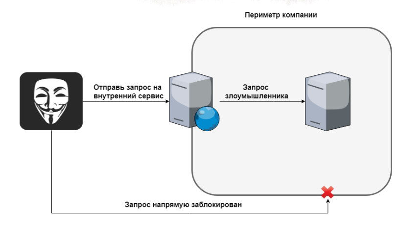

# уязвимость/атака

## Описание
SSRF (server side request forgery) — это уязвимость, для использования которой злоумышленник передает на уязвимое вэб-приложение URL-запрос, в результате выполнения которого приложение может обратиться к внутренним ресурсам сети, недоступным напрямую извне, а в последствии передать информацию злоумышленнику.

## Классификация
- Basic
Показывает атакующему ответ на выполненный запрос, который может содержать критическую информацию
- Blind
В результате атакующий не видит ответа на запрос, но приложение его исполняет

## Условия
- ОС: любая
- язык: любая
- компоненты: библиотеки, инфраструктура сети
- настройки: разные

## Детектирование
Для детектирования можно использовать [BurpSuite](https://portswigger.net/burp) и ручное тестирование путем ввода различных URL представленных ниже.
Необходимо учитывать возможность атаки при возможности на вэб приложении прикладывать файлы используя URL.
Потенциально уязвимым можно считать Веб-приложение, которое должно уметь брать какой-то контент с других серверов, при этом путь до контента задается пользователем.

## Эксплуатация
Внедрение GET запроса путем ввода ссылки на запрашиваемый ресурс

### Инструменты
- [localhost dns resolver](https://nip.io/)
- [BurpSuite](https://portswigger.net/burp)
- [Сервис упрощения ссылок](https://clck.ru/)

## Ущерб
- Сканирование внутренней сети компании, например сканер портов.
- Обращение к внутренним ресурсам компании
- Исполнение произвольных HTTP GET-запросов

## Защита
### Основные меры
- Фильтровать DNS и локальные IP адреса
- Проверять схему в ссылке и работать только с HTTP/HTTPS

### Превентивные меры
- Ограничить доступ к внутренней инфраструктуре для потенциально подверженных SSRF серверов
- Вынести  функционал в отдельный изолированный сервис общий для всех команд

## Дополнительно
Источники:
- [pycurl and requests methods comparation](https://github.com/0xyd/Pycurl-vs-Requests)
- [PayloadsAllTheThings](https://github.com/swisskyrepo/PayloadsAllTheThings/blob/master/Server%20Side%20Request%20Forgery/README.md)

## Обход защиты
Использование ASCII и UTF символов; сервисов подобных [nip.io](https://nip.io/); ipv6 адресов; ip адресов в других системах счисления, отличных от десятичной; DNS серверов; использование сервисов упрощения ссылок.

## Примеры URL
- localhost
- 127.1
- 127.1:80
- customer2-app-127-0-0-1.nip.io
- 127.127.127.127
- 2130706433
- 0177.0.0.1
- [0:0:0:0:0:ffff:127.0.0.1]
- 127.0.1
- 0
- 127.*.*.*

## Примеры использования
Примеры сканера портов и фильтрации GET запросов приложены в папке app/

http://127.0.0.1/get_url_curl?url=http://localhostsecret?show_me_secrets=true
Также кроме localhost можно написать различные примеры представленные выше.

 